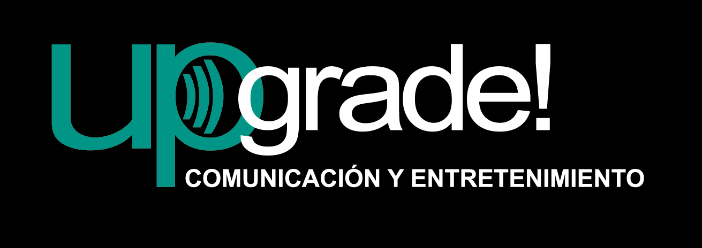
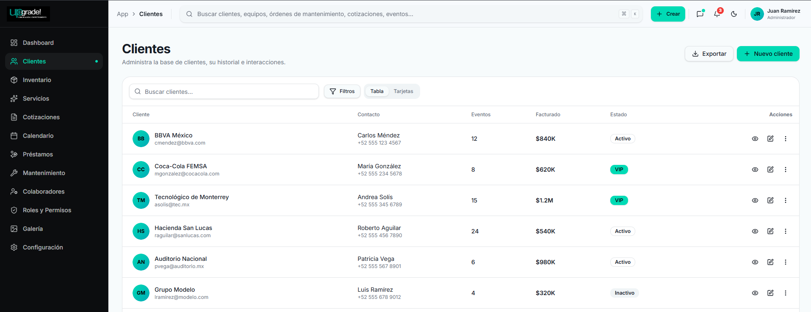

# 🚀 UPGRADE 

<p align="center">
  
</p>

<h3 align="center">
Sistema Integral de Gestión Administrativa para Upgrade! Comunicación y Entretenimiento
</h3>

<p align="center">
  Plataforma empresarial desarrollada para la administración centralizada de operaciones, inventario audiovisual, cotizaciones, eventos y mantenimiento de equipos.
</p>

---

## 📖 Descripción

**UPGRADE ERP** es una plataforma web desarrollada como proyecto universitario para la empresa **Upgrade! Comunicación y Entretenimiento**, organización costarricense especializada en:

* Producción audiovisual
* Sonido profesional
* Iluminación para eventos
* Pantallas LED
* Eventos corporativos
* Alquiler de equipos audiovisuales
* Soluciones tecnológicas para entretenimiento

Actualmente muchas operaciones se realizan mediante procesos manuales y herramientas dispersas. Este proyecto busca centralizar y digitalizar la gestión administrativa mediante una solución moderna, segura y escalable.

---

## 🖼️ Vista Previa

<p align="center">
  
</p>

---

## 🎯 Objetivo General

Diseñar e implementar una plataforma administrativa integral que permita optimizar la gestión de clientes, inventario, eventos, cotizaciones, préstamos y mantenimiento de equipos audiovisuales, mejorando la eficiencia operativa y la toma de decisiones dentro de la organización.

---

## ⚙️ Módulos del Sistema

### 📊 Dashboard Ejecutivo

* Indicadores clave de negocio
* Eventos programados
* Equipos disponibles
* Equipos en mantenimiento
* Cotizaciones pendientes
* Actividad reciente

### 👥 Gestión de Clientes

* Registro de clientes
* Historial de servicios
* Historial de cotizaciones
* Búsquedas y filtros avanzados

### 📦 Inventario Audiovisual

* Control de equipos
* Categorías de inventario
* Estados de ubicación
* Historial de movimientos

### 🔧 Mantenimiento de Equipos

* Mantenimientos preventivos
* Mantenimientos correctivos
* Control de órdenes de trabajo
* Historial técnico
* Evidencias fotográficas
* Costos de mantenimiento

### 📝 Cotizaciones y Proformas

* Generación de cotizaciones
* Conversión a proformas
* Cálculo automático de costos
* Gestión comercial

### 📅 Calendario Operativo

* Gestión de eventos
* Asignación de recursos
* Programación de actividades
* Seguimiento operativo

### 🚚 Préstamos de Equipos

* Registro de préstamos
* Control de devoluciones
* Seguimiento de vencimientos

### 👨‍💼 Colaboradores

* Gestión del personal
* Asignación de roles
* Participación en eventos

### 🔐 Roles y Permisos

* Control de acceso basado en roles (RBAC)
* Administración de permisos
* Seguridad del sistema

### 🖼️ Galería Corporativa

* Administración de imágenes
* Organización por categorías
* Gestión de contenido público

### ⚙️ Configuración de Cuenta

* Perfil de usuario
* Seguridad
* Preferencias del sistema
* Internacionalización

---

## 🌐 Landing Page Pública

El sistema incluye una página web pública para la captación de clientes potenciales.

Secciones:

* Inicio
* Quiénes Somos
* Servicios
* Galería de Proyectos
* Clientes
* Testimonios
* Solicitar Cotización
* Contacto

---

## 🛠️ Tecnologías Utilizadas

### Backend

* Java 21
* Spring Boot
* Spring MVC
* Spring Security
* Spring Data JPA
* Hibernate

### Frontend

* Thymeleaf
* Bootstrap 5
* HTML5
* CSS3
* JavaScript

### Base de Datos

* MySQL

### Herramientas

* Git
* GitHub
* Maven
* IntelliJ IDEA

### Arquitectura

* MVC (Model - View - Controller)
* RBAC (Role Based Access Control)
* Repository Pattern
* Service Layer Pattern

---

## 🔒 Seguridad

El sistema implementa:

* Autenticación segura
* Contraseñas cifradas con BCrypt
* Control de acceso por roles
* Protección CSRF
* Gestión de sesiones
* Restricción de módulos por permisos

---

## 📂 Estructura General

```text
src/
├── controller/
├── service/
├── repository/
├── model/
├── dto/
├── security/
├── config/
├── util/
└── resources/
    ├── templates/
    ├── static/
    └── messages/
```

## 🎨 Identidad Visual

Colores corporativos de Upgrade!

| Color                | Código  |
| -------------------- | ------- |
| Turquesa Corporativo | #01DFBC |
| Negro Corporativo    | #000000 |

---

## 👨‍💻 Equipo de Desarrollo

* Gabriel Cabalceta Quirós
* Shaonny Gabriela Aguilar Elizondo
* Jose Daniel Pereira Sánchez
* Kevin David Aguilar Solano

---

## 🎓 Proyecto Académico

Universidad Fidélitas

Curso:
SC-403 Desarrollo de Aplicaciones Web y Patrones

Profesor:
Andrés Aiello Rodríguez

---

## 📄 Licencia

Proyecto desarrollado con fines académicos para la Universidad Fidélitas.

No autorizado para uso comercial sin aprobación previa de los autores y de Upgrade! Comunicación y Entretenimiento.
